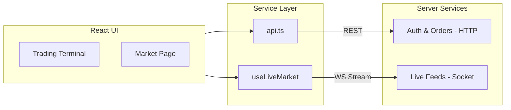
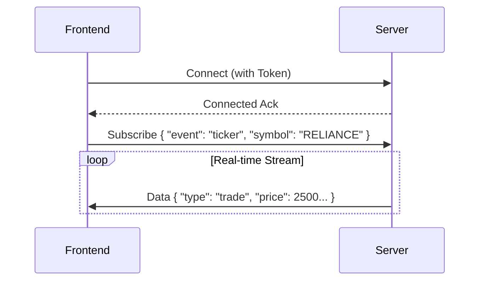

# 🔗 API Integration Documentation

[← Back to Root](../README.md)

---

## 📍 Table of Contents

1. [🛠 Communication Architecture](#-communication-architecture)
2. [🏗️ Centralized Wrapper (requestJSON)](#️-centralized-wrapper-requestjson)
3. [📡 Core Endpoints](#-core-endpoints)
4. [⚡ WebSocket Integration](#-websocket-integration)

---

## 🏗️ Backend System Overview

To better understand the integration, here is the organizational structure of the backend services the frontend interacts with:

```text
internal/api/
├── router.go             ← sets up all routes, middleware, route groups
├── order_handler.go      ← handlers for /orders/*
├── portfolio_handler.go  ← handlers for /portfolio, /trades
├── bot_handler.go        ← handlers for /bots/*
└── ws/
    ├── hub.go            ← manages WebSocket connections, fan-out
    └── handler.go        ← upgrades HTTP → WebSocket, message routing

internal/auth/
├── handler.go            ← handlers for /auth/register, /auth/login
├── middleware.go         ← JWT middleware injection
└── service.go            ← password hashing & token logic
```

---

## 🧐 What & How

| Layer             | What it does                             | How it works                                                                         |
| :---------------- | :--------------------------------------- | :----------------------------------------------------------------------------------- |
| **REST API**      | Handles stateful actions (Orders, Auth). | Standard `Fetch` requests wrapped in a typed `requestJSON` helper.                   |
| **WS Stream**     | Provides stateless, live market updates. | Persistent TCP connection managed by the `useLiveMarket` hooks.                      |
| **Auth Injector** | Secures all outbound traffic.            | A centralized interceptor checks `localStorage` for a JWT and appends it to headers. |

---

## 🛠 Communication Architecture

The frontend communicates with multiple backend services using a mix of traditional REST and full-duplex WebSockets.



---

## 🏗️ Centralized Wrapper (requestJSON)

All HTTP requests are funneled through a high-level wrapper to ensure consistency.

> [!NOTE]
> This wrapper automatically attaches the **JWT Authorization Header** if a token is present in the browser's `localStorage`.

```typescript
// Example usage of the centralized request wrapper
const response = await requestJSON<MyDataType>("/v1/orders", {
  method: "GET",
});
```

---

## 📡 Core Endpoints

### 🔑 Authentication

| Method | Endpoint       | Description                         |
| :----- | :------------- | :---------------------------------- |
| `POST` | `/auth/login`  | Authenticates user and returns JWT. |
| `POST` | `/auth/signup` | Creates a new user account.         |

### 📈 Trading & Orders

| Method | Endpoint         | Parameters                               |
| :----- | :--------------- | :--------------------------------------- |
| `POST` | `/orders/market` | `symbol`, `action`, `quantity`           |
| `POST` | `/orders/limit`  | `symbol`, `action`, `quantity`, `price`  |
| `GET`  | `/portfolio`     | Returns current user positions and cash. |

---

## ⚡ WebSocket Integration

The real-time market data feed uses persistent WebSocket connections.



<details>
<summary><b>🛠 WebSocket Event Types</b></summary>

- `ticker`: 24h summary and best bid/ask.
- `trade`: Individual trade execution reports.
- `candle`: OHLC data for charting.
- `portfolio`: Live balance and position updates.
</details>

> [!WARNING]
> WebSockets will auto-reconnect on a 3-second delay. Ensure your backend supports session persistence for a seamless experience.
