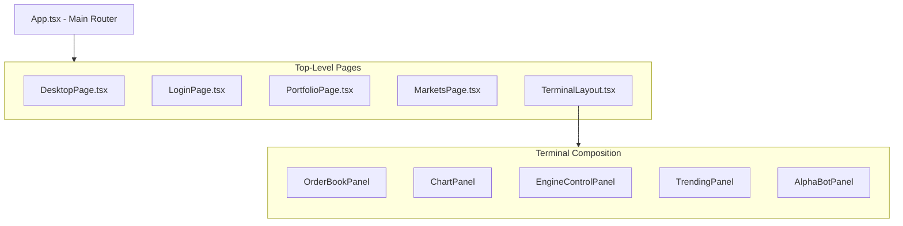
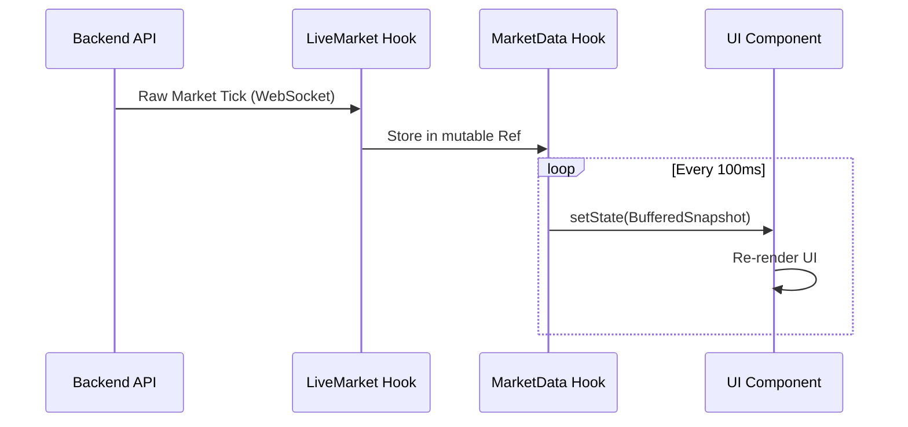

# 🏛️ Architecture Documentation

[← Back to Root](../README.md)

---

## 📍 Table of Contents

1. [🧩 Component Hierarchy](#-component-hierarchy)
2. [⚖️ Project Philosophy](#️-project-philosophy)
3. [⚡ Core Technical Patterns](#-core-technical-patterns)
4. [🎨 UI & Styling System](#-ui-styling-system)
5. [🚀 Performance Considerations](#-performance-considerations)

---

## 🧐 What & How

| Feature               | What it does                                                 | How it works                                                                               |
| :-------------------- | :----------------------------------------------------------- | :----------------------------------------------------------------------------------------- |
| **Modular Dashboard** | Orchestrates 5+ independent trading panels in a single view. | Uses a central `TerminalLayout` with `CSS Grid` and `useLiveMarket` context.               |
| **Data Throttling**   | Protects the UI from 600+ ticks/sec update storms.           | Decouples raw feed reception from React state updates using a 100ms flush interval.        |
| **Auth Guards**       | Secures sensitive routes and API calls.                      | Wraps pages in `<ProtectedRoute>` and injects JWTs via a centralized `api.ts` intercepter. |

---

## 🧩 Component Hierarchy

The application follows a modular, hierarchical structure to manage complexity and ensure a clean separation of concerns.

---

## ⚖️ Project Philosophy

Our engineering decisions are guided by four core principles:

- **⚡ Performance First**: Financial UIs must be fast. We use throttling and optimized SVG rendering for a lag-free experience.
- **💎 Visual Excellence**: We prioritize a "Premium" aesthetic using glassmorphism and radiant gradients.
- **📦 Modular Design**: Features are self-contained. The terminal is a composition of independent, reconfigurable panels.
- **🛡️ Reliability**: Robust WebSocket reconnection logic and centralized API handling ensure data accuracy.

---

## ⚡ Core Technical Patterns

### 1. Centralized API Service

All communication with the backend is handled through `src/services/api.ts`.

> [!TIP]
> Centralizing requests allows us to inject headers (JWT), handle errors, and normalize responses in a single location.

### 2. Live Data Strategy (Throttled Flush)

To maintain 60FPS UI performance, we decouple data reception from UI rendering.

<b>🔍 Implementation Detail: Why we throttle</b>

In high-volatility markets, the backend may emit hundreds of updates per second. React cannot efficiently re-render a complex chart at that frequency. By buffering in a `ref` and flushing to `state` on an interval, we protect the main thread and ensure smooth animations.

---

## 🎨 UI & Styling System

### 💎 Design Aesthetic

- **Glassmorphism**: Subtle backdrop blurs and semi-transparent borders.
- **Premium Dark Mode**: A custom Navy-Emerald palette designated as "Oak Capital".
- **Micro-animations**: Hover states and data transitions that feel alive.

### 🛠 Tools

| Feature       | tool               | Description                                     |
| :------------ | :----------------- | :---------------------------------------------- |
| **Framework** | Tailwind CSS 4     | Utility-first styling with modern CSS features. |
| **Icons**     | Lucide React       | Clean, consistent SVG icon set.                 |
| **Charts**    | Lightweight Charts | High-performance Canvas-based charting engine.  |

---

## 🚀 Performance Considerations

- **Memoization**: Extensive use of `useMemo` and `useCallback` to prevent unnecessary component updates during high-frequency data ticks.
- **SVG Optimization**: Simulated charts on the market page use optimized SVG paths for high performance without the weight of full charting libraries.
- **Web Worker Potential**: (Future Road Map) Offloading heavy data transformation and PnL calculation to background threads.
