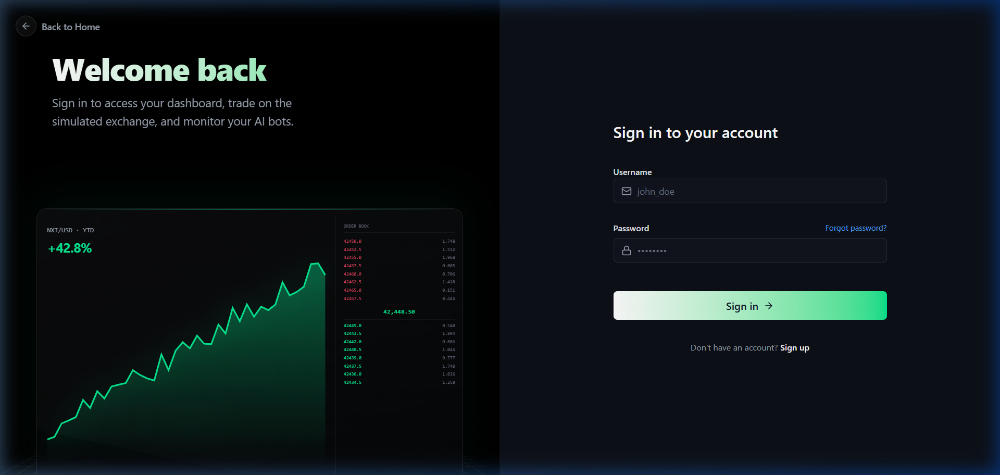
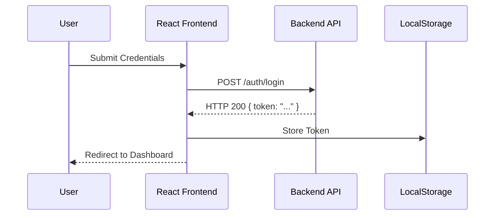

# 🔐 Authentication Documentation

[← Back to Root](../../README.md)

---

## 📍 Table of Contents

1. [🔄 Logic Flow](#-logic-flow)
2. [🛡️ Security Architecture](#️-security-architecture)
3. [🚪 Onboarding Views](#-onboarding-views)

---

## 🧐 What & How

**What it does**: Ensures that only registered and authenticated users can access private trading data and execute orders.

**How it works**:

1. **Validation**: Credentials are sent to the `/auth/login` endpoint.
2. **Persistence**: On success, the backend returns a **JWT (JSON Web Token)** which the frontend stores in `localStorage`.
3. **Authorization**: Every subsequent API call automatically pulls this token and attaches it to the `Authorization` header.
4. **Protection**: The `ProtectedRoute` component checks for the token locally before allowing React Router to navigate to sensitive pages.

---

## 🔄 Logic Flow

The application implements a stateless, JWT-based authentication system.

---

## 🛡️ Security Architecture

### 1. Route Guarding

Protected routes are wrapped in a `ProtectedRoute` component that validates the presence of a token before rendering.

> [!IMPORTANT]
> If a token is expired or missing, the user is automatically redirected to the `/login` page with their original intent stored in state for post-login redirection.

### 2. Token Synchronization

Custom `auth-change` events are dispatched on login/logout to synchronize UI state across multiple browser tabs, ensuring a consistent session experience.

---

## 🚪 Onboarding Flow

| View        | Purpose                       | Visual Style                            |
| :---------- | :---------------------------- | :-------------------------------------- |
| **Sign In** | User login to active session. | Glassmorphism with live line-chart bg.  |
| **Sign Up** | New user registration.        | Clean, high-performance dashboard view. |
| **Landing** | Public home page.             | Full-scale terminal showcase.           |

<b>🔍 Technical Detail: JWT Handling</b>

Tokens are treated as sensitive data. They are never logged to the console and are stripped of white spaces during the injection process in the `api.ts` service layer.

