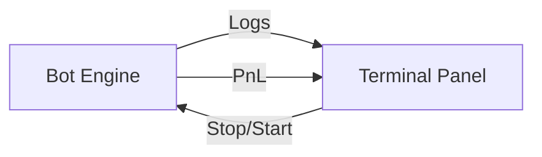

# 🤖 Bot Management Documentation

[← Back to Root](../../README.md)

---

## 📍 Table of Contents

1. [🕊️ BulBul (BYOB)](#️-bulbul-byob)
2. [🚀 Alphabot (Managed)](#-alphabot-managed)
3. [📊 Strategy Monitoring](#-strategy-monitoring)

---

## 🧐 What & How

**What it does**: Enables users to automate their trading strategies, reducing manual effort and emotional bias.

**How it works**:

- **Strategy Building (BulBul)**: Uses a visual node-based editor where users drag logic blocks to define entry/exit rules. This is converted to a JSON configuration and sent to the server.
- **Hosted Execution (Alphabot)**: Pre-coded algorithms run 24/7 on the backend. The frontend provides a control panel to start/stop These instances and monitor their real-time performance.

---

## 🕊️ BulBul (BYOB)

**Build-Your-Own-Bot** is a graphical strategy builder designed for users who want to create custom logic without writing extensive code.

### 🧱 Technical Components

- **Node Editor**: A visual canvas (`AlphaBotEditor.tsx`) using custom SVG connectors to link logical blocks (e.g., "If RSI > 70 then Sell").
- **Simulation Engine**: Run your bot in virtual mode against live WebSocket data to validate logic without capital risk.

---

## 🚀 Alphabot (Managed)

Alphabot provides access to professional, pre-built strategies running on the server side.

### 📜 Available Strategies

| Strategy           | Signal          | Best For            |
| :----------------- | :-------------- | :------------------ |
| **Flagship v2**    | EMA Crossover   | Trending Markets    |
| **Mean Reversion** | Bollinger Bands | Range-bound Markets |
| **MACD Scalper**   | MACD Momentum   | High Volatility     |

---

## 📊 Strategy Monitoring

### 📋 Actionable Features

- [ ] Toggle between **Simulation** and **Live** capital.
- [ ] Monitor real-time logs for every executed action.
- [ ] View bot-specific PnL calculations independent of your main portfolio.

> [!TIP]
> Always test new strategies in **Simulation Mode** for at least 24 hours before deploying with live capital.
