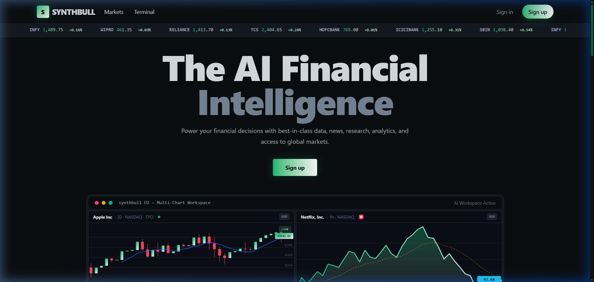
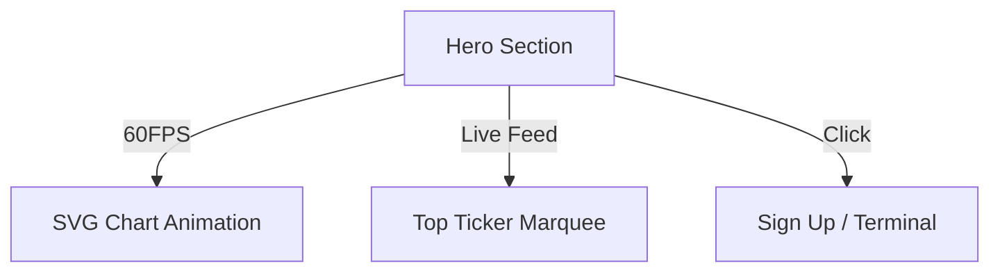

# 🏠 Landing Page Documentation

[← Back to Root](../../README.md)

---

## 📍 Table of Contents

1. [✨ Visual Design](#-visual-design)
2. [🚀 Interactive Hero](#-interactive-hero)
3. [🛠 Performance Isolation](#-performance-isolation)

---

## 🧐 What & How

**What it does**: Attracts new users and showcases the platform's power before they even log in.

**How it works**:

- **Interactive Demos**: Features a simulated terminal view that uses `requestAnimationFrame` to drive custom SVG animations, providing a 60FPS "Premium" experience.
- **Conversion funnel**: Strategically places Calls-to-Action (CTAs) that lead to the secure registration and login flows.
- **Dynamic Content**: Uses a mock market feed to display atmospheric price action, creating a sense of "Live" energy.

---

## ✨ Visual Design

The Landing Page (`DesktopPage.tsx`) serves as the premium gateway to the platform.

### 💎 Key Elements

- **Oak Capital Theme**: Custom navy/emerald dark mode with high-contrast accent colors.
- **Glassmorphism**: Elegant use of backdrop blurs and semi-transparent borders for a "Premium" feel.
- **Dynamic Trust**: Rotating interactive badges of financial ecosystem partners.

---

## 🚀 Interactive Hero

The centerpiece of the landing page is an **Animating Multi-Chart Workspace**.

> [!TIP]
> The charts on the landing page are pure SVG animations driven by `requestAnimationFrame`, ensuring perfect smoothness without the weight of heavy charting libraries.

---

## 🛠 Performance Isolation

To prevent high-frequency animations from affecting page stability, we use a specialized memoization strategy.

### 📋 Optimization Steps

- [x] Isolate chart logic into `renderCandlestickChart()`.
- [x] Use `IntersectionObserver` to pause animations when the user scrolls away.
- [x] Memoize tickers and price inputs

<b>🔍 Technical Note: Animation Rationale</b>

By using CSS hardware acceleration and `requestAnimationFrame`, we maintain a "Premium" feel while keeping CPU usage below 5% for most users.

