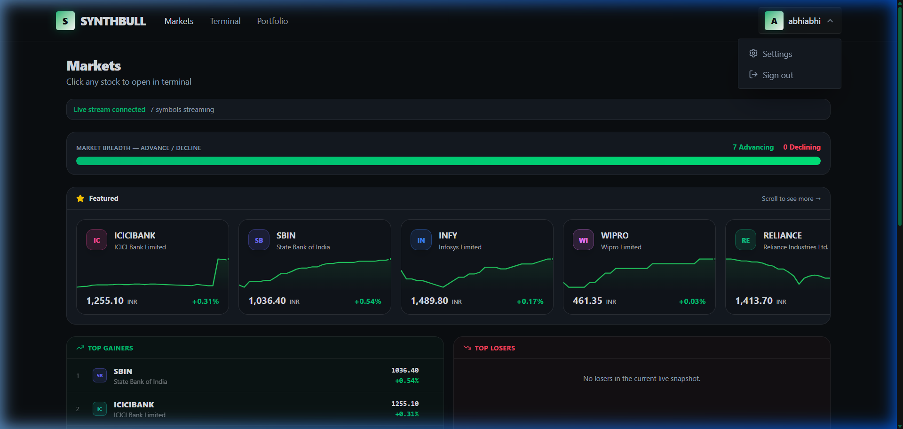
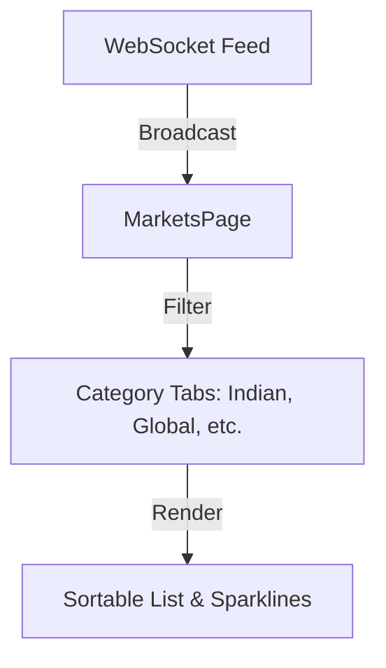

# 🌍 Market Overview Documentation

[← Back to Root](../../README.md)

---

## 📍 Table of Contents

1. [🔍 Discovery Features](#-discovery-features)
2. [📡 Live Data Mapping](#-live-data-mapping)
3. [📊 UI Layout](#-ui-layout)

---

## 🧐 What & How

**What it does**: Allows users to scan the entire market at a glance to identify trending assets and opportunities.

**How it works**:

- **Bulk Subscription**: The page registers for updates on a large set of tickers.
- **Visualisation**: Uses optimized SVG sparklines to render the last 40 price points of each asset without the performance cost of a full charting library.
- **Sorting & Filtering**: Performs client-side processing to rank assets by percentage change, volume, or momentum.

---

## 🔍 Discovery Features

The Market Overview page (`MarketsPage.tsx`) acts as the command center for asset discovery.

### ⚡ Movers & Volatility

- **Heatmaps**: Visual representation of the most active assets.
- **Top Gainers/Losers**: Real-time ranking of the day's best and worst performers.
- **Sentiment Bar**: A high-level view of market breadth (Advancers vs. Decliners).

---

## 📡 Live Data Mapping

The page utilizes a global market feed to maintain accuracy across hundreds of symbols.

---

## 📊 UI Layout

| Element        | Component           | Logic                                                     |
| :------------- | :------------------ | :-------------------------------------------------------- |
| **Sparklines** | SVG Path Gen        | Renders last 40 ticks as a mini trend-line.               |
| **Search**     | Fuse.js (Simulated) | Real-time fuzzy filtering of ticker names.                |
| **Table**      | React Memo          | Optimized for low-CPU impact during high-frequency ticks. |

> [!NOTE]
> Clicking any symbol in the market list will seamlessly redirect you to the **Trading Terminal** with that symbol pre-loaded.
