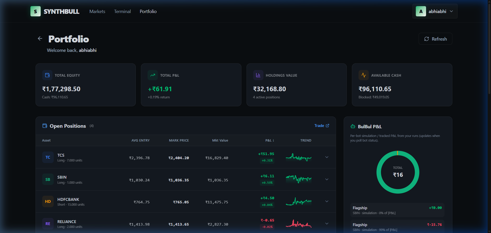
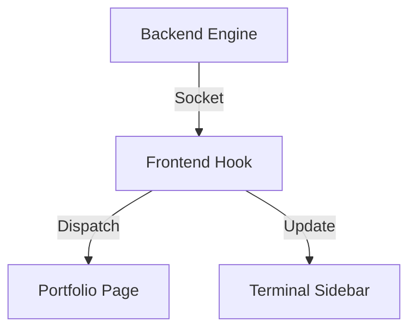

# 💼 Portfolio Management Documentation

[← Back to Root](../../README.md)

---

## 📍 Table of Contents

1. [📊 Performance Tracking](#-performance-tracking)
2. [🔄 Synchronization Logic](#-synchronization-logic)
3. [🧩 Asset Breakdown](#-asset-breakdown)

---

## 🧐 What & How

**What it does**: Provides a real-time consolidated view of all holdings, cash balances, and trading performance.

**How it works**:

- **Data Aggregation**: Fetches the base position list from the REST API on page load.
- **Live Valuation**: Subscribes to the prices of all held assets via WebSocket.
- **PnL Engine**: A background calculation loop in `usePortfolio` subtracts the `AverageEntryPrice` from the `CurrentMarketPrice` to compute unrealized gains/losses in real-time.

---

## 📊 Performance Tracking

The Portfolio view provides comprehensive real-time insight into your trading performance.

### 🧮 Calculations

We use the following logic to keep your balances up-to-date:

- **Unrealized PnL**: $$(MarkPrice - EntryPrice) \times Quantity$$
- **Account Equity**: $$Cash + \sum UnrealizedPnL_i$$

---

## 🔄 Synchronization Logic

Portfolio data is synchronized across the entire stack.

---

## 🧩 Asset Breakdown

### 📋 Key Features

- [x] Real-time equity curve visualization.
- [x] Grouping of positions by sector or asset class.
- [x] **Quick Close**: Liquidate positions instantly from the list.

> [!IMPORTANT]
> All currency values are displayed based on the user's preferred currency (Default: USD), with live conversion rates handled on the server.
