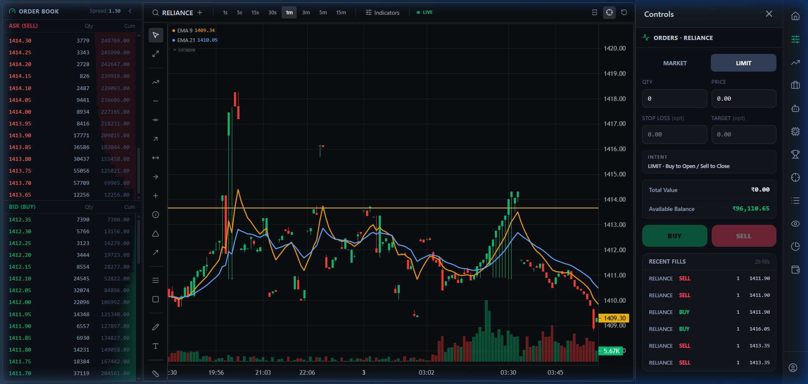
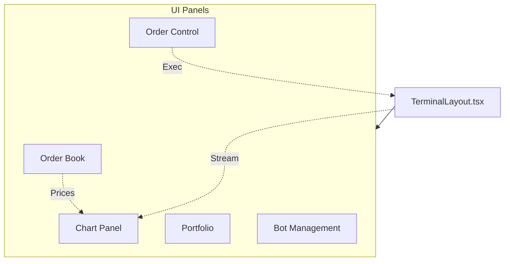

# 📊 Trading Terminal Documentation

[← Back to Root](../../README.md)

---

## 📍 Table of Contents

1. [🧩 Component Interaction](#-component-interaction-map)
2. [🏗️ Terminal Orchestration](#️-terminal-orchestration)
3. [🧱 Key Modules](#-key-modules)
4. [⌨️ Global Hotkeys](#-global-hotkeys)
5. [🔄 Data Operations](#-data-operations)

---

## 🧩 Component Interaction Map

The terminal is a composition of specialized panels that share a unified market data context.

---

## 🧐 What & How

| Operation           | What it does                                    | How it works                                                                    |
| :------------------ | :---------------------------------------------- | :------------------------------------------------------------------------------ |
| **Live Charting**   | Renders sub-second price action for any asset.  | Integrates **Lightweight Charts** with a throttled market data stream ($100ms$ flush). |
| **Order Execution** | Submits Buy/Sell intents to the matching engine. | Uses `useTradeControls` for validation and `api.ts` for secure `POST` requests. |
| **Market Depth**    | Visualizes liquidity at various price levels.   | Real-time `OrderBookPanel` subscription to depth-specific WebSocket events.     |

---

## 🏗️ Terminal Orchestration

`TerminalLayout.tsx` is the primary dashboard container. It manages:

- **Resizing**: Modular grid layout with collapsible sidebars.
- **Context Injection**: Providing live feeds to all child panels.
- **Input Mastery**: Global hotkey listeners for high-speed trading.

---

## 🧱 Key Modules

### 1. 📈 Chart Panel (`ChartPanel.tsx`)

Utilizes **Lightweight Charts** for high-performance visual analysis.

- **Multichart**: Side-by-side comparison of different assets.
- **Overlays**: Visual indicators of entry and exit points.

### 2. 📚 Order Book (`OrderBookPanel.tsx`)

Visualizes current market depth and liquidity.

- **Spread Analysis**: Dynamic calculation of the bid-ask gap.
- **Tick History**: Real-time ticker for recently executed trades.

### 3. ⚡ Order Control (`ControlPanel.tsx`)

The primary interface for submitting trade intents.

- **Intelligent Defaulting**: Automatically adjusts prices based on selected direction.
- **Safety**: Validates quantity and balance before submission.

---

## ⌨️ Global Hotkeys

Professional traders rely on speed. The terminal implements the following keyboard mapping:

| Action                     | Key Combination |
| :------------------------- | :-------------- |
| **Buy Instrument**         | <kbd>B</kbd>    |
| **Sell Instrument**        | <kbd>S</kbd>    |
| **Switch to Market**       | <kbd>M</kbd>    |
| **Switch to Limit**        | <kbd>N</kbd>    |
| **Quick Buy (At Market)**  | <kbd>Q</kbd>    |
| **Quick Sell (At Market)** | <kbd>E</kbd>    |

---

## 🔄 Data Operations

### 🌊 Live Streaming Flow

1. **Connect**: `useLiveMarket` initiates the socket.
2. **Buffer**: `useMarketData` throttles the incoming 1k+ msg/sec ticks.
3. **Paint**: Components re-render only at the specified flush interval (100ms).

<b>🛠 Troubleshooting: Missing Chart Data</b>

If the charts are empty, check the console for "WebSocket Connection Failed". This usually indicates that the `VITE_API_BASE_URL` is pointing to an incorrect protocol (use `http` version, the hook will resolve `ws` automatically).

