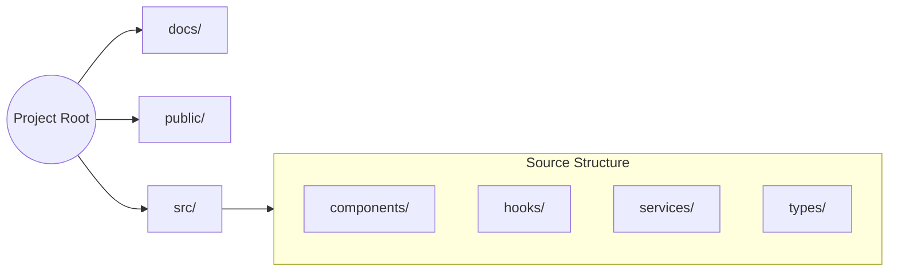

# 📁 File Structure Documentation

[← Back to Root](../README.md)

---

## 📍 Table of Contents
1. [📂 Root Directory](#-root-directory)
2. [🌳 Directory Relationship](#-directory-relationship)
3. [💻 Source Code (src/)](#-source-code-src)
4. [🛠 Configuration Files](#-configuration-files)

---

## 🧐 What & How

**What it does**: Organizes the codebase into logical domains to ensure scalability, discoverability, and ease of maintenance.

**How it works**:
- **Atomic Components**: UI elements are broken down into `components/` based on their feature area.
- **Separated Logic**: Data fetching and WebSocket management are moved out of components and into a dedicated `hooks/` layer.
- **Typed Interfaces**: A central `types/` directory ensures that data structures are consistent across the entire application, preventing runtime errors.

---

## 🌳 Directory Relationship



---

## 📂 Root Directory

| Path | Purpose |
| :--- | :--- |
| `docs/` | Comprehensive technical documentation (you are here). |
| `public/` | Static assets, icons, and public visual resources. |
| `src/` | Primary application source code. |
| `docker-compose.yml` | Container orchestration for development and staging. |
| `package.json` | Project metadata and dependency management. |

---

### 🧱 Source Code Hierarchy (src/)

```text
src/
├── components/
│   ├── terminal/         ← Atomic panels (Order Book, Charts)
│   ├── alphaBot/         ← Strategy builder & bot logic
│   └── markets/          ← Global market search & trends
├── hooks/
│   ├── useLiveMarket.ts  ← Primary WebSocket engine
│   ├── useMarketData.ts  ← Flush & throttle logic
│   └── usePortfolio.ts   ← Asset & PnL tracking
├── services/
│   └── api.ts            ← Centralized REST wrapper
└── types/
    └── market.ts         ← Shared TS interfaces
```

---

### 🏗️ Core Application Files

---

## 🛠 Configuration Files

<details>
<summary><b>📋 Important Build & Env Files</b></summary>

- `.env`: Environment variables (e.g., `VITE_API_BASE_URL`).
- `vite.config.ts`: Compilation and build settings.
- `tsconfig.json`: TypeScript compiler rules.
- `tailwind.config.js`: Visual tokens and theme extensions.
</details>

> [!IMPORTANT]
> Never commit your `.env` file to version control. Use the `.env.example` as a template for new collaborators.
