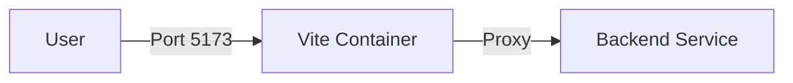

# ⚙️ Getting Started

[← Back to Root](../README.md)

---

## ⚙️ Getting Started Guide

---

## 📍 Table of Contents
1. [📋 Prerequisites](#-prerequisites)
2. [🚀 Installation](#-installation)
3. [🛠 Local Development](#-local-development)
4. [📦 Production & Deployment](#-production--deployment)
5. [🐳 Docker Workflows](#-docker-workflows)

---

## 📋 Prerequisites

Before you begin, ensure you have the following installed:

- [ ] **Node.js**: Version 18.x or higher.
- [ ] **NPM**: Version 9.x or higher.
- [ ] **Docker Desktop**: (Optional) For containerized development.

---

## 🚀 Installation

Follow these steps to clone and set up the project:

```bash
# 1. Clone the repository
git clone <repository-url>
cd Opensoft-26-Frontend

# 2. Install dependencies
npm install

# 3. Configure environment
cp .env.example .env
```

> [!IMPORTANT]
> You MUST set the `VITE_API_BASE_URL` in your `.env` file to point to a running backend instance.

---

## 🛠 Local Development

To start the development server with Hot Module Replacement (HMR):

```bash
npm run dev
```

The application will be accessible at: **`http://localhost:5173`**

---

## 📦 Production & Deployment

For building a production-ready optimized bundle:

```bash
# Generate the /dist folder
npm run build

# Preview the production build locally
npm run preview
```

| Command | Action |
| :--- | :--- |
| `npm run build` | Compiles and minifies assets for production. |
| `npm run lint` | Runs ESLint to check for code quality issues. |

---

## 🐳 Docker Workflows

We provide a Dockerized environment for consistent staging and development.



### 📋 Actionable Steps
- [ ] Ensure Docker is running on your machine.
- [ ] Run `docker-compose up` to start the frontend.
- [ ] (Optional) Use `docker-compose up --build` if you've changed dependencies.

<details>
<summary><b>🔍 Troubleshooting: Docker Port Conflicts</b></summary>

If you receive an "Address already in use" error, check if another process is running on port `5173` or if your backend postgres service (default `5432`) is conflicting with a local instance. Stop the local service and retry.
</details>
