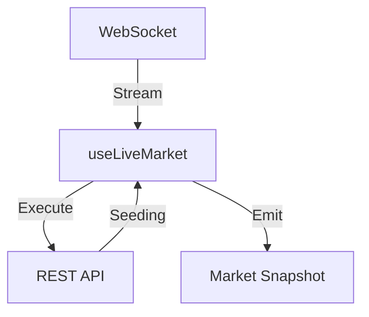
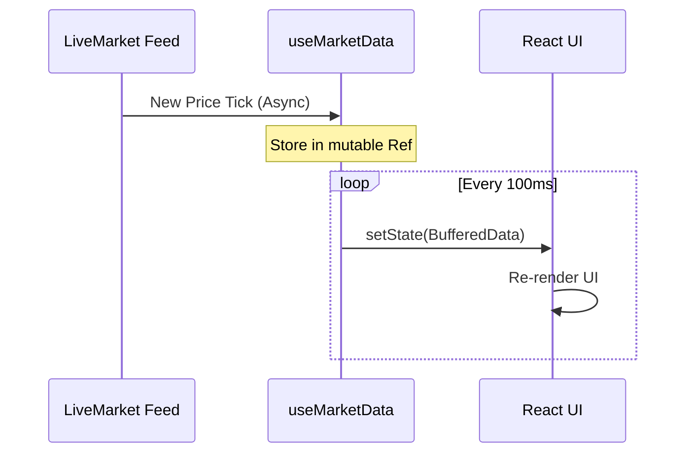

# 🪝 Custom Hooks Documentation

[← Back to Root](../README.md)

---

## 📍 Table of Contents

1. [🚀 Overview](#-overview)
2. [📡 useLiveMarket (The Engine)](#-uselivemarket-the-engine)
3. [⚡ useMarketData (The Throttle)](#-usemarketdata-the-throttle)
4. [⚙️ useTradeControls](#️-usetradecontrols)
5. [📈 usePortfolio](#-useportfolio)

---

## 🚀 Overview

Custom hooks are the "Brain" of the application, encapsulating complex data flows and state management behind clean, reusable interfaces.

---

## 🧐 Functional Deep Dive

### 🌀 The Data Lifecycle

To understand how our hooks operate, we must look at the path of a single price update:

1. **What**: A price changes in the market.
2. **How**:
   - `useLiveMarket` catches the raw WebSocket packet.
   - `useMarketData` buffers the value in a `useRef`.
   - The UI re-renders only once per 100ms cycle, pulling the latest value from that ref.

---

## 📡 useLiveMarket (The Engine)

The foundational hook for real-time interaction. It manages the entire WebSocket lifecycle and interacts with the REST service for execution.

### 📋 Responsibilities

- [x] WebSocket Lifecycle (Connect / Reconnect / Heartbeat).
- [x] Multi-symbol state buffering.
- [x] Order execution routing.
- [x] Historical data (seeding) orchestration.



---

## ⚡ useMarketData (The Throttle)

A performance-critical hook that protects the UI from update storms.

> [!IMPORTANT]
> Market updates can arrive at $1000$ msg/sec. This hook buffers them and flushes to React state at a controlled interval.



<details>
<summary><b>🔍 Code Pattern: Throttled State Update</b></summary>

```typescript
const latestRef = useRef<MarketSnapshot>(snapshot);

useEffect(() => {
  const unsubscribe = feed.subscribe((next) => {
    latestRef.current = next; // Update ref instantly
  });

  const flush = setInterval(() => {
    setSnapshot(cloneSnapshot(latestRef.current)); // Update state on interval
  }, 100);
}, []);
```

</details>

---

## ⚙️ useTradeControls

Manages the complex state of the order entry form.

| State        | Type     | Description                    |
| :----------- | :------- | :----------------------------- |
| `quantity`   | `number` | Size of the trade.             |
| `limitPrice` | `number` | Target price for limit orders. |
| `orderType`  | `enum`   | Market or Limit.               |

### 🛠 Actionable Helpers

- `quickBuy()` / `quickSell()`: Automatically pins price to market and executes.
- `setLong()` / `setShort()`: Toggles trade direction logic.

---

## 📈 usePortfolio

Calculates and streams real-time PnL across all open positions.

### 🧮 Logic

$$TotalPnL = \sum (MarketPrice_i - EntryPrice_i) \times Quantity_i$$

---
