# 🏛️ Oak Capital — OpenSoft 2026

[-silver?style=for-the-badge&logo=target)](https://github.com/AYUSHSAINI9876/OpenSoft-2026)
[](https://github.com/AYUSHSAINI9876/OpenSoft-2026)

**Oak Capital** is a high-frequency trading platform built for **OpenSoft 2026**. It features a lightning-fast C++ Matching Engine, a robust Go backend, and a real-time React dashboard.

> [!IMPORTANT]
> **Silver Medal Winner (2nd Place)** 🥈
> Representing **Azad Hall of Residence** in the **General Championship Technology Opensoft-2026**.

---

## 🚀 Key Features

### ⚡ High-Performance Matching Engine
- **Engine Core:** Written in pure C++ using **AVL Trees** for the Limit Order Book and **FIFO Queues** for order priority.
- **Speed:** Capable of matching **1.4M+ orders per second** with sub-microsecond latency.
- **Zero-Latency Bridge:** Utilizes **CGO** to link the C++ shared library directly into the Go binary, eliminating IPC overhead.

### 📈 Market Simulation & Real-time Data
- **GBM Simulator:** Real-time market data generated via **Geometric Brownian Motion** (GBM) goroutines.
- **Live Streaming:** Real-time WebSocket fan-out for order book deltas, trade executions, and OHLCV candles.
- **Dynamic Charts:** Integration with **Lightweight Charts** for professional-grade technical analysis.

### 🤖 Trading Bots & Automation
- **Alpha Bot:** EMA Crossover strategy executor.
- **Market Maker Bot:** Dynamic spread capture and liquidity provision.
- **Bulbul BYOB:** A visual node-graph strategy builder allowing users to design custom logic without code.

---

## 📸 Platform Preview

<div align="center">
  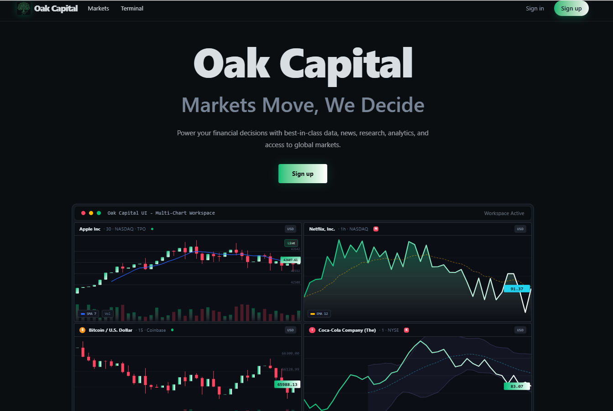 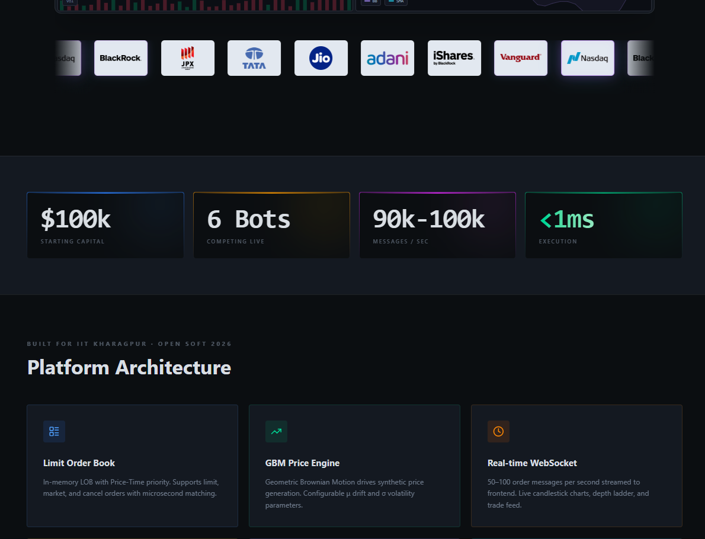
  <br />
  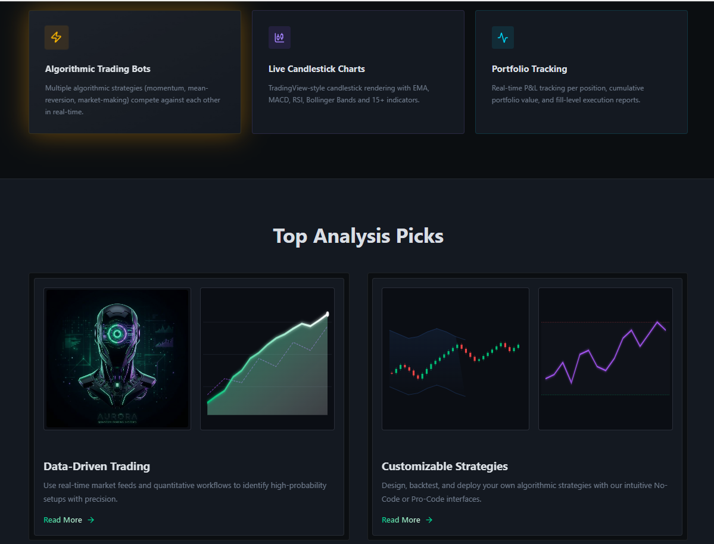 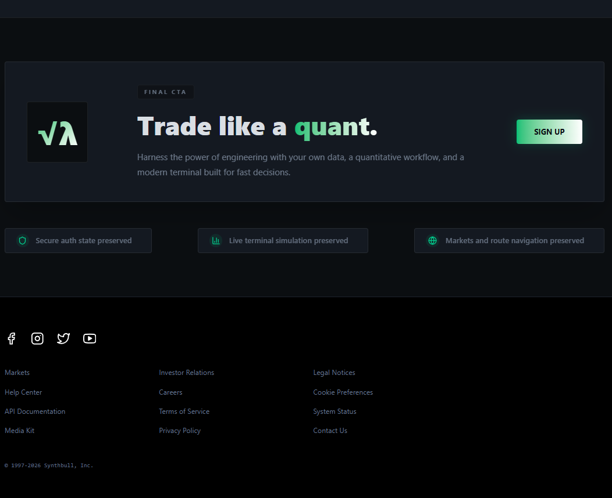
  <br />
  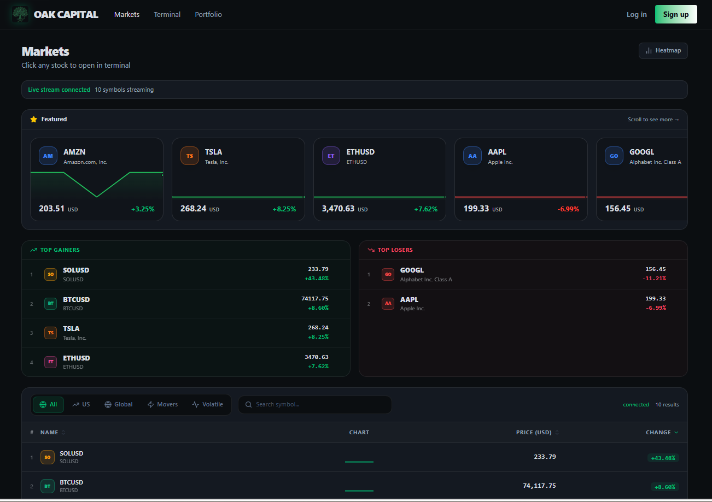 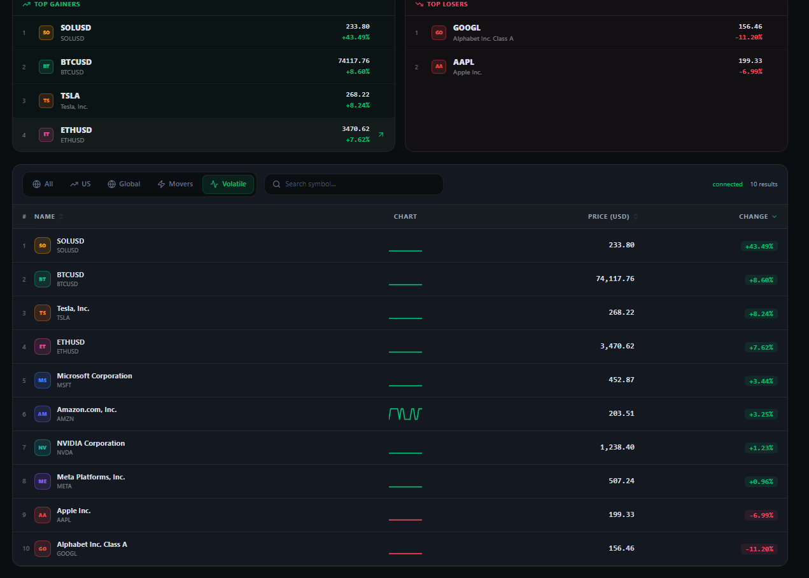
  <br />
  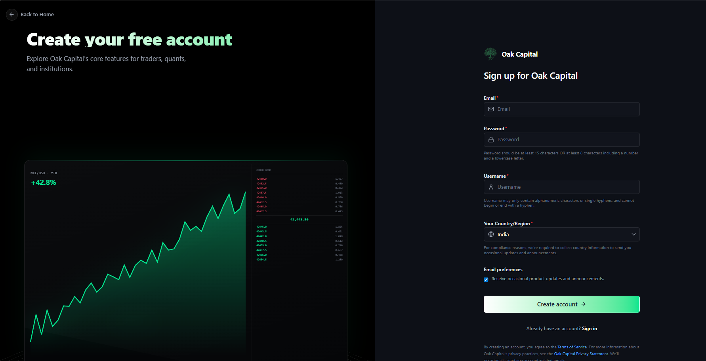 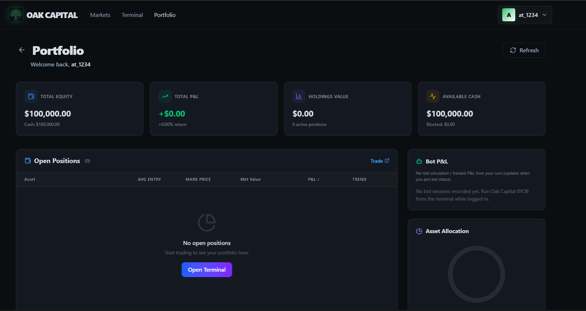
  <br />
  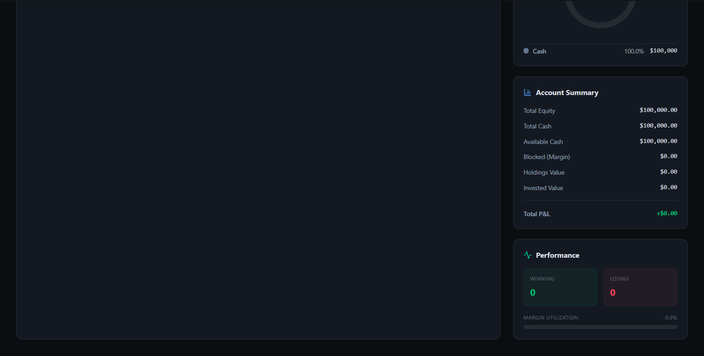 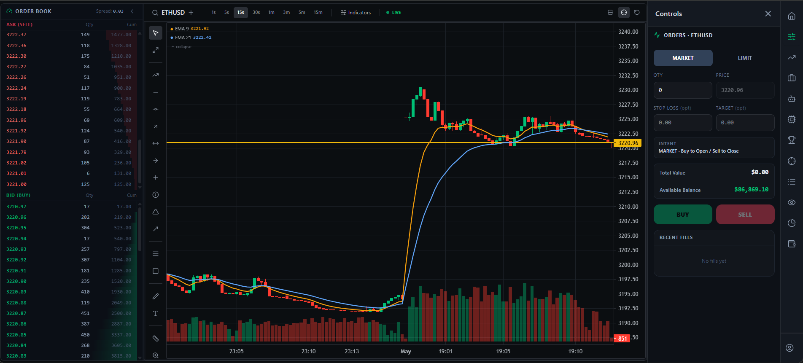
  <br />
  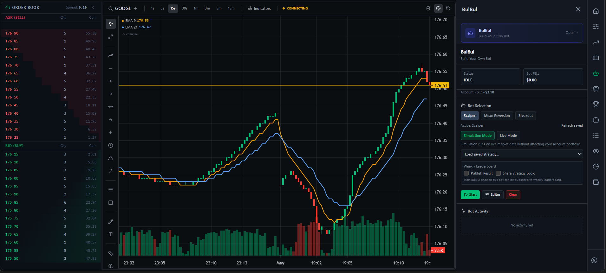 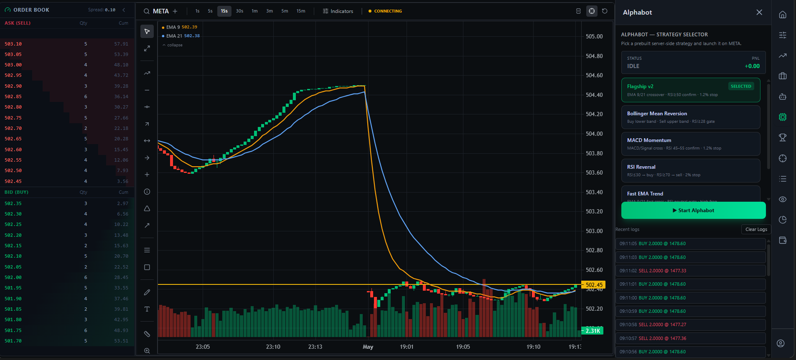
  <br />
  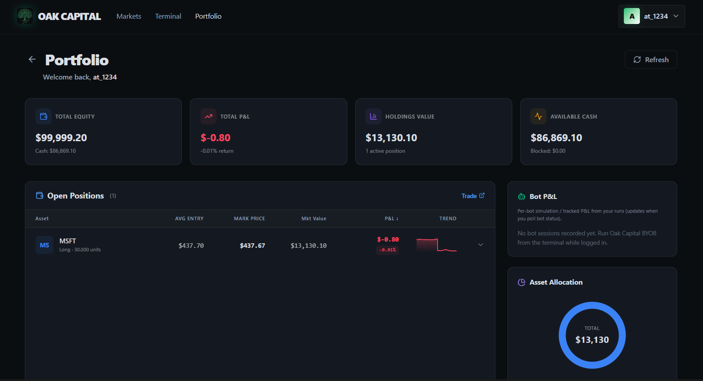 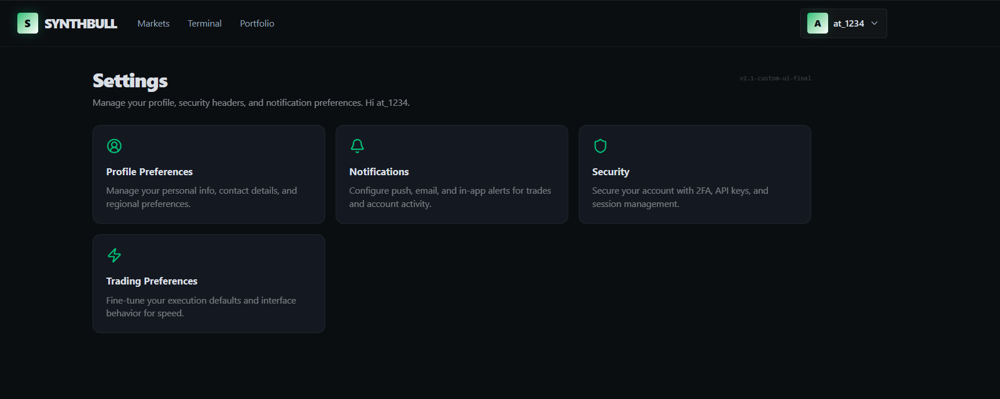
</div>

---

## 🏗️ Architecture

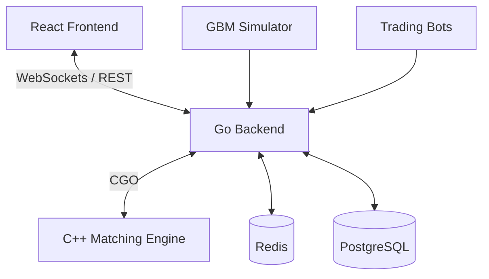

---

## 🛠️ Environment Requirements

To run this project locally, you need the following installed:
- **Docker & Docker Compose** (Highly Recommended)
- **Go 1.25+** (If running natively)
- **Node.js 22+** (If running natively)
- **GCC / C++ Compiler** (Required for building the Matching Engine shared library)

---

## 🏁 Quick Start (Docker)

The fastest way to get the entire stack running is using Docker.

### 1. Clone the repository
```bash
git clone https://github.com/AYUSHSAINI9876/OpenSoft-2026.git
cd OpenSoft-2026
```

### 2. Start the Backend
```bash
cd Opensoft-26-Backend
docker compose up --build
```
*Wait for the log: `🚀 Successfully connected to Database!`*

### 3. Start the Frontend
In a new terminal:
```bash
cd Opensoft-26-Frontend
docker compose up --build
```

Access the platform at **http://localhost:3976**.

---

## 📂 Project Structure

- `Opensoft-26-Backend/`: Go server, C++ Matching Engine, and Simulation logic.
- `Opensoft-26-Frontend/`: Vite + React + TailwindCSS dashboard.
- `screenshots/`: Visual documentation of the platform.

---

## 🏆 Credits

Built with ❤️ by the **Azad Hall of Residence** team for OpenSoft 2026.

**Award:** Silver Medal (2nd Place) 🥈
**Event:** General Championship Technology, IIT Kharagpur.
